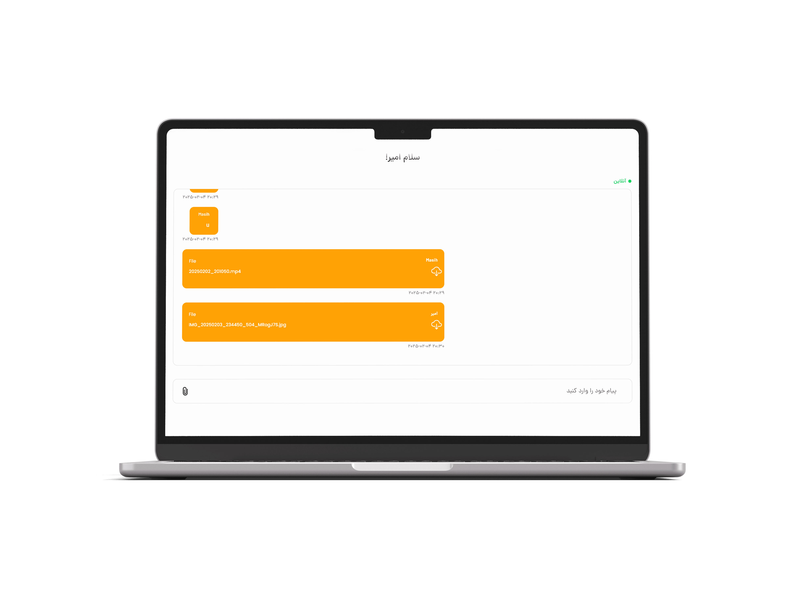

# ChatApp UI

### Description:
A clean and modern user interface built with Flutter designed to work seamlessly with the ChatApp Backend, providing an excellent user experience for real-time chat applications.

---

## Features:

-  **Login Screen**: Secure user login with a modern design.
-  **Chat Interface**: Real-time messaging with a sleek layout.
-  **User Profile**: Personalized profile management.
-  **Message History**: Easy access to past conversations.
-  **Push Notifications**: Instant alerts for new messages.


## Installation:

### Prerequisites:
- Flutter 3.0 or higher
- Dart 2.12 or higher
- Android Studio (recommended)
- iOS Simulator (optional for iOS testing)

### Steps:
```bash
git clone https://github.com/yourusername/ChatAppUI.git
cd ChatAppUI
flutter pub get
```

## Usage:
```bash
flutter run -v
```
---

## Screenshots:

### Chat Screen:
  
  

A secure and intuitive login interface that allows users to authenticate easily.

### Chat Interface:
  

Experience real-time communication with a modern and responsive design.

---

Thank you for choosing ChatApp Backend! 🚀
