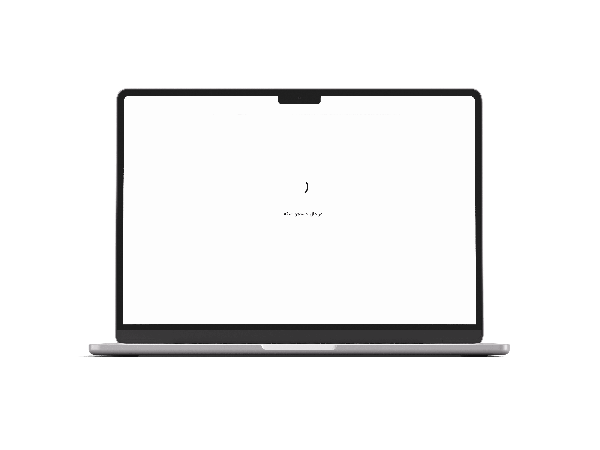
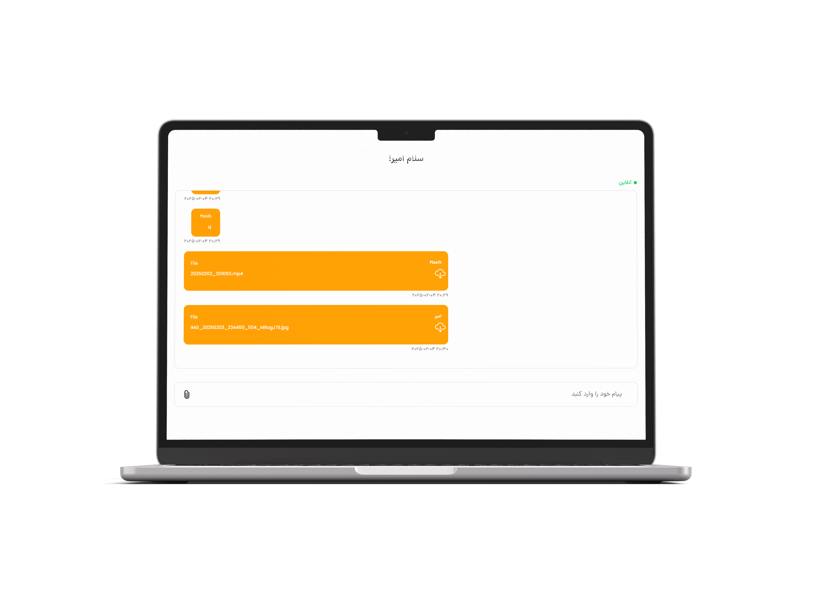

# ChatApp Project
[English](README.md) | [فارسی](README-fa.md)
### Overview:
A comprehensive chat application consisting of a backend and frontend. The backend is built with Django, while the frontend uses Flutter for a cross-platform experience.

### Components:
- **Backend**: [Django Backend](Backend/README.md)
- **Application**: [Flutter UI](application/README.md)

---

### Quick Start:

1. Clone this repository:
   ```bash
   git clone https://github.com/DivSlayer/Chat-App.git
   ```
2. Navigate to the backend directory and follow the instructions in its README.md.

3. In a separate terminal, navigate to the application directory and follow the instructions in its README.

### Screenshots:

#### Server Finder Screen:
| Android Server Finder Screen | Windows Server Finder Screen |
|----------------------|----------------------|
|  |  |

Server Finder screen.

#### Login Screen:
| Android Login Screen | Windows Login Screen |
|----------------------|----------------------|
|  |  |

A secure and intuitive login interface that allows users to authenticate easily.

#### Chat Interface:
| Android Chat Screen | Windows Chat Screen |
|----------------------|----------------------|
|  |  |

Experience real-time communication with a modern and responsive design.

---

Thank you for choosing ChatApp Project! 🚀
