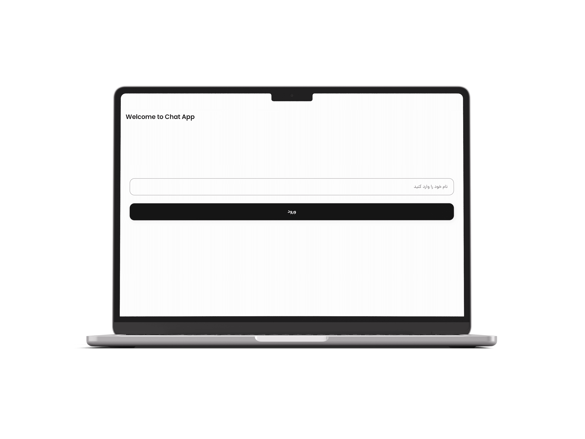

# ChatApp Project

## Overview: 
A comprehensive chat application consisting of a backend and frontend. The backend is built with Django, while the frontend uses Flutter for a cross-platform experience.

### Components:
- **Backend**: [Django Backend](backend/README.md)
- **Application**: [Flutter UI](application/README.md)

---

## Quick Start:

1. Clone this repository:
   ```bash
   git clone https://github.com/geeksloths/Chat-App.git
2. Navigate to the backend directory and follow the instructions in its README.md.

3. In a separate terminal, navigate to the application directory and follow the instructions in its README.

## Screenshots:

## Screenshots:

### Server Finder Screen:
<div style="display: flex; gap: 10px;width:100%;">
  
  
</div>

Server Finder screen.

### Login Screen:
<div style="display: flex; gap: 10px;width:100%;">
  
  
</div>

Experience real-time communication with a modern and responsive design.

### Chat Interface:
<div style="display: flex; gap: 10px;width:100%;">
  
  
</div>

Experience real-time communication with a modern and responsive design.

---